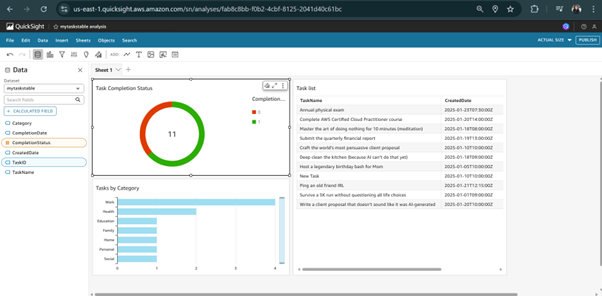

# AWS DynamoDB to QuickSight Data Pipeline

## Overview
This project demonstrates how to extract data from **DynamoDB**, process it with **AWS Lambda**, store query results in **Athena**, and visualize insights in **Amazon QuickSight**.

## Architecture
1. **DynamoDB** stores structured data in JSON format.
2. **AWS Glue** extracts metadata from DynamoDB.
3. **AWS Lambda** retrieves data from DynamoDB and loads it into **Athena**.
4. **Athena** executes queries and stores results in an **S3 spill bucket**.
5. **QuickSight** connects to Athena for visualization.

## Technologies Used
- **AWS DynamoDB**
- **AWS Glue**
- **AWS Lambda**
- **AWS Athena**
- **Amazon QuickSight**
- **AWS IAM**

## Steps to Set Up
1. **Create a DynamoDB Table (`MyTasksTable`)** and populate it with sample data.
2. **Set up AWS Glue** to create metadata for DynamoDB.
3. **Use Lambda** to fetch data from DynamoDB and send it to Athena.
4. **Query data using Athena** and store results in an **S3 spill bucket**.
5. **Connect Athena to QuickSight** and build interactive dashboards.

## IAM Policies
IAM policies required for:
- **Lambda to invoke Athena Federated Query**
- **Athena to access S3 spill bucket**

## Screenshots

### QuickSight Dashboard

